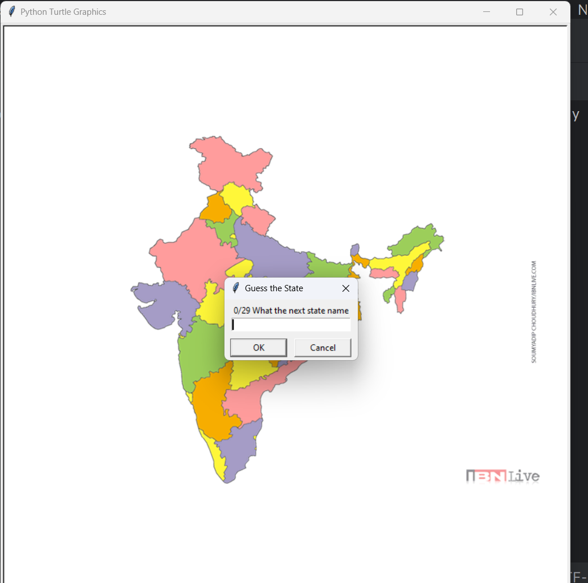

# State Game

## State Name in CSV file Format

```
State,x,y
Andhra Pradesh,-48,-120
Arunachal Pradesh,180,105
Assam,151,71
Bihar,51,54
Chhattisgarh,-4,-14
Goa,-138,-123
Gujarat,-157,17
Haryana,-90,119
Himachal Pradesh,-73,157
Jharkhand ,45,15
Karnataka,-112,-140
Kerala,-105,-206
Madhya Pradesh,-59,11
Maharashtra,-114,-48
Manipur,172,40
Meghalaya,124,52
Mizoram,159,6
Nagaland,186,61
Odisha ,83,10
Punjab,-104,144
Rajasthan,-137,72
Sikkim,94,84
Tamil Nadu,-72,-200
Telangana,-54,-79
Tripura,139,19
Uttar Pradesh,-24,79
Uttarakhand,-40,128
West Bengal,88,12
Jammu and Kashmir,-82,204
```

## PROGRAM:
```
import turtle
import pandas

screen = turtle.Screen()
screen.setup(width=800,height=800)
image = "india.gif"
screen.addshape(image)
turtle.shape(image)

data = pandas.read_csv("india_29_state- Sheet1.csv")
india_states = data.State.to_list()
find_state = []

while len(india_states)<50:

    user_state = screen.textinput(title="Guess the State",prompt=f"{len(find_state)}/29 What the next state name").title()
    
    if user_state in india_states:
        find_state.append(user_state)
        state_data = data[data.State == user_state]
        tom = turtle.Turtle()
        tom.hideturtle()
        tom.penup()
        tom.goto(state_data.x.item(),state_data.y.item())
        tom.write(user_state)

    if user_state=="Exit":
        missing_state = [state for state in india_states if state not in find_state]
        df = pandas.DataFrame(missing_state)
        df.to_csv("Not_Find_State.csv")
        print(df)
        break
```

## OUTPUT:
